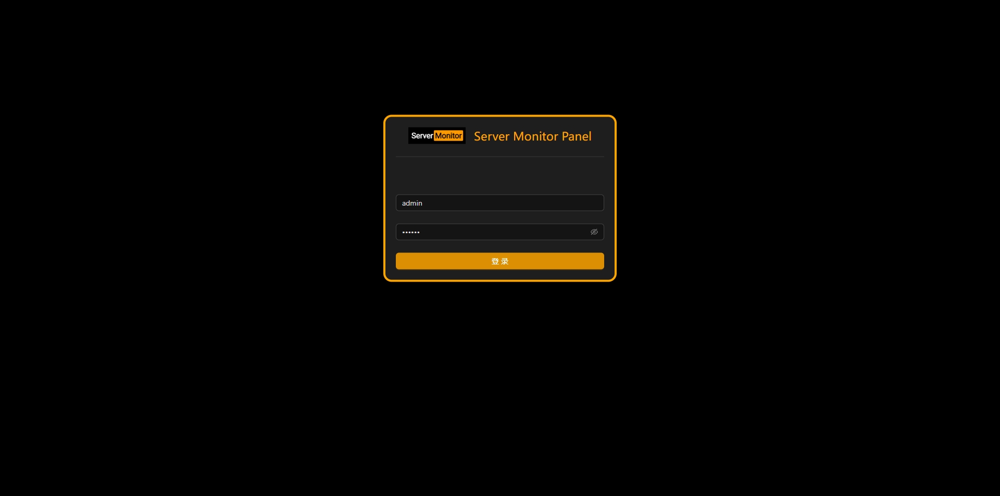
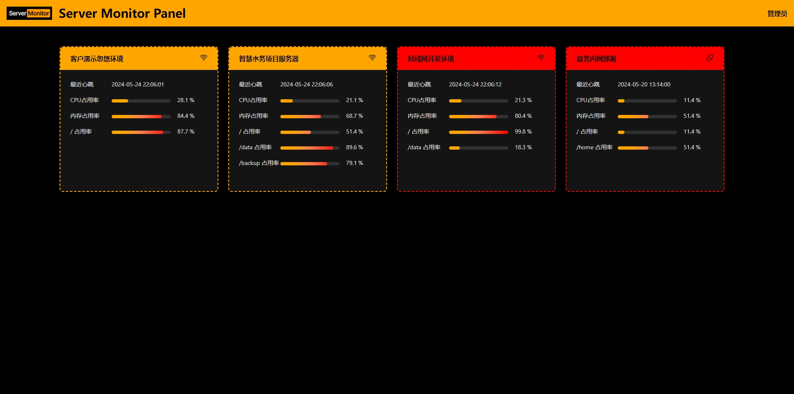

# 服务器运维监控

## 项目说明

为解决多服务器、多环境运维过程中的问题，开发的简易运维大屏，提供可视化展示及短信报警功能。

大胆地使用`Pornhub`风格配色，使得运维工作别有一番风味 ✌

## 技术栈

前端： TypeScript + React + UmiJS

后端： Python + Flask + SQlite

## 目录组织

doc: 通用文档相关

frontend: Web 端代码

client: 客户端（被监控的主机）代码

server: 服务端（Web 后端及监控中心）代码
